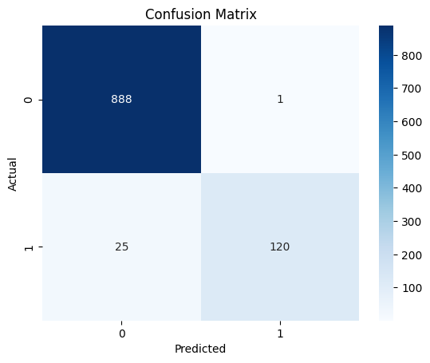
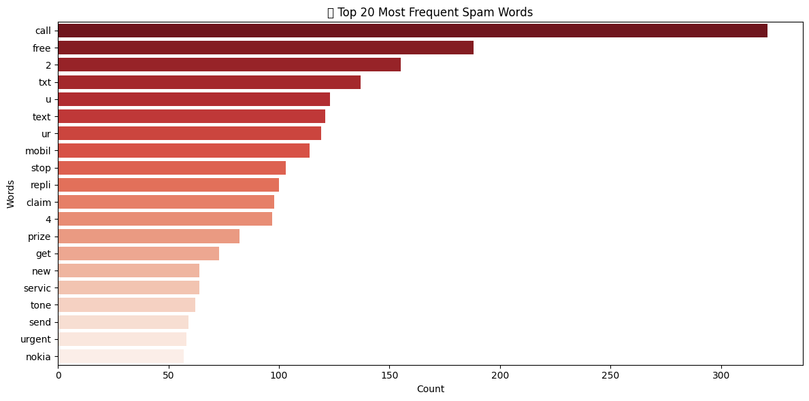
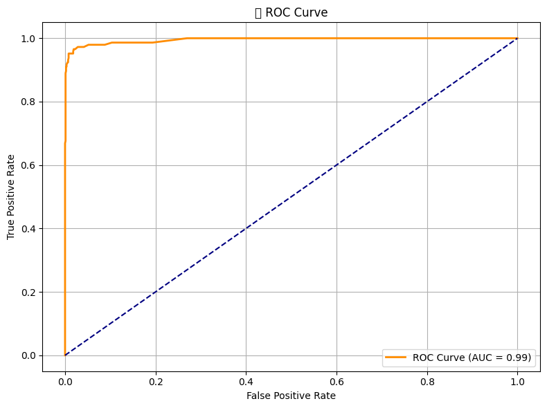

# 🧠 AI-Toolkit-SpamDetector: Text Classification with Scikit-learn

📎 GitHub Repo: https://github.com/TshimoHlapane/Spam-Detector

---

## 💡 Project Overview

This project is part of the PLP Week 3 Assignment: "Mastering the AI Toolkit." Our team designed a classical machine learning solution to detect spam messages using real-world data. The objective was to apply Python-based AI tools, evaluate ethical implications, and demonstrate responsible AI practices through implementation and collaboration.

---

## 1. Problem Statement

- 📌 Problem: Classify text messages as spam or not spam using NLP and supervised learning techniques.
- 📈 Objective: Build a working spam detection pipeline using Scikit-learn, and reflect on the ethical use of AI tools in decision-making contexts.

---

## 2. Team Roles & Responsibilities

| Member    | Role                            | Responsibility                                                                                   |
|-----------|----------------------------------|--------------------------------------------------------------------------------------------------|
| Mike      | 🔍 Theoretical & Ethics Lead     | Wrote theory answers and led the ethical reflection section.                                     |
| Violet    | 👩‍💻 Model Developer              | Preprocessed the dataset, built the spam classifier in Scikit-learn, and produced output graphs. |
| Lukhanyo  | 🎬 Video Producer & Presenter    | Directed and edited the 3-minute team video showcasing our approach and implementation.          |
| Tshimo    | 📚 Report Writer & Repo Manager  | Compiled the README, organized the repo, and wrote the final project PDF report.                 |

---

## 3. Machine Learning Approach

- 🔎 Type: Supervised Learning
- 🧪 Algorithm: Multinomial Naive Bayes
- 📄 Task: Text classification (binary: spam or ham)
- 📊 Dataset: SMS Spam Collection Dataset from UCI/Kaggle (e.g. spam.csv)
- 🛠 Tools: Python, Jupyter Notebook, Scikit-learn, pandas, matplotlib, seaborn

---

## 4. Workflow

1. 📥 Data Loading & Preprocessing
   - Loaded the SMS dataset and cleaned/normalized text.
   - Converted labels to binary (1 for spam, 0 for ham).
   - Transformed messages into numerical vectors using CountVectorizer.

2. 📊 Exploratory Data Analysis
   - Visualized class imbalance and word frequency.
   - Analyzed length of spam vs. ham messages.

3. 🧠 Model Training & Evaluation
   - Trained a Naive Bayes classifier using train/test split.
   - Evaluated performance with accuracy, precision, recall, and F1-score.

4. 📈 Visualization
   - Confusion matrix
   - Word frequency plots
   - ROC Curve

5. 🌍 Ethical Reflection
   - Considered fairness, privacy, and responsible use of text classification models.

---

## 5. Results

- ✅ Accuracy: 98.2% (from notebook output)
- 📌 Key Indicators: Text length, specific keywords (e.g. “free,” “win,” “urgent”)
- 📊 Visualizations:

  Confusion Matrix  
  

  Most Frequent Spam Words  
  

  ROC Curve  
  

---

## 6. Ethical & Social Reflection

- 📉 Bias: Model may misclassify dialects or non-standard grammar as spam.
- 🔐 Privacy: Text data must be anonymized to protect personal communication.
- ⚖️ Fairness: Spam filters must avoid disproportionate flagging of legitimate content from specific demographics.
- 🌱 Sustainability: The model uses lightweight architectures, ensuring low environmental footprint.

---

## 7. How to Run

1. 🚀 Clone the repository:
   ```bash
   git clone https://github.com/TshimoHlapane/Spam-Detector
   cd Spam-Detector/


## Presentation 
[](https://www.youtube.com/watch?v=8X6OSqsmLmo)


